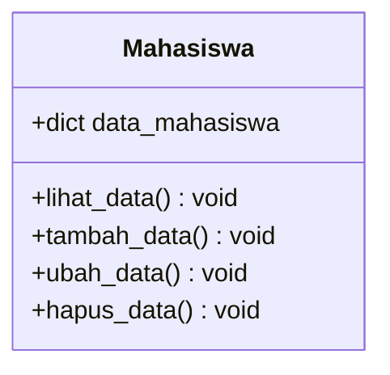
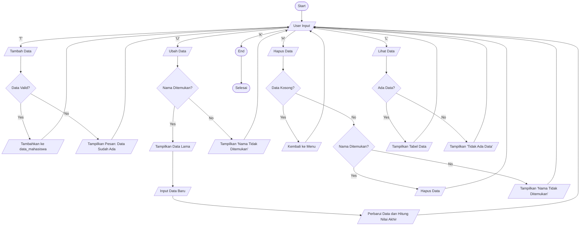

# Praktikum8

## Diagram Class


## Flowchart


# Pengelolaan Data Mahasiswa
Program berbasis Python yang digunakan untuk mengelola data mahasiswa, seperti menambahkan, melihat, mengubah, menghapus, dan mencari data mahasiswa. Berikut adalah penjelasan fungsi-fungsi utama dalam kode:

## 1. Struktur Data

```python 
data_mahasiswa = {}
```
- ```data_mahasiswa```: Dictionary untuk menyimpan data mahasiswa.
- Key: NIM (Nomor Induk Mahasiswa)
- Value: Dictionary yang berisi detail mahasiswa seperti nama, nilai tugas, UTS, UAS, dan nilai akhir.

## 2. Fungsi Utama
### a. ```lihat_data()```
- Fungsi ini menampilkan semua data mahasiswa dalam format tabel.
- Jika tidak ada data, tabel kosong akan ditampilkan dengan pesan "TIDAK ADA DATA".
- Jika ada data, setiap mahasiswa ditampilkan dengan nomor, nama, NIM, nilai tugas, UTS, UAS, dan nilai akhir (dihitung otomatis).

### b. ```tambah_data()```
- Digunakan untuk menambahkan data mahasiswa baru.
#### 1. Meminta pengguna memasukkan:
- NIM, Nama, Nilai Tugas, Nilai UTS, dan Nilai UAS.
#### 2. Menghitung Nilai Akhir menggunakan rumus:
- Nilai Akhir=(Nilai Tugas×30%)+(Nilai UTS×35%)+(Nilai UAS×35%)
#### 3. Menyimpan data ke dalam dictionary ```data_mahasiswa```.
#### 4. Memeriksa jika NIM sudah ada untuk menghindari duplikasi.

### c. ```ubah_data()```
- Mengubah data mahasiswa berdasarkan NIM.
#### 1. Menampilkan data mahasiswa menggunakan fungsi ```lihat_data()```.
#### 2. Meminta pengguna memasukkan NIM mahasiswa yang akan diubah.
#### 3. Jika NIM ditemukan, pengguna dapat memasukkan data baru (Nama, Nilai Tugas, UTS, UAS).
#### 4. Nilai Akhir dihitung ulang, dan data diperbarui.

### d. ```hapus_data()```
- Menghapus data mahasiswa berdasarkan NIM.
#### 1. Menampilkan data mahasiswa menggunakan fungsi ```lihat_data()```.
#### 2. Meminta pengguna memasukkan NIM yang ingin dihapus.
#### 3. Jika NIM ditemukan, data dihapus dari dictionary ```data_mahasiswa```.


### e. ```cari_data()```
- Mencari data mahasiswa berdasarkan Nama atau NIM.
#### 1. Meminta pengguna memasukkan keyword pencarian.
#### 2. Mencari data yang sesuai (Nama atau NIM) dengan metode filter.
#### 3. Menampilkan hasil pencarian dalam format tabel.
#### 4. Jika tidak ditemukan, menampilkan pesan "Data tidak ditemukan".


## 3. Perulangan Utama
```python
while True:
    pilihan = input("[(L)ihat (T)ambah (U)bah (H)apus (C)ari (K)eluar] : ").lower()
    ...
```
- Program berjalan dalam perulangan while hingga pengguna memilih untuk keluar (```K```).
- Berdasarkan input pengguna, fungsi yang sesuai akan dipanggil:
  - ```L```: Memanggil ```lihat_data()```
  - ```T```: Memanggil ```tambah_data()```
  - ```U```: Memanggil ```ubah_data()```
  - ```H```: Memanggil ```hapus_data()```
  - ```C```: Memanggil ```cari_data()```
  - ```K```: Mengakhiri program

## 4. Alur Eksekusi
#### 1. Program menunggu input pengguna untuk memilih aksi.
#### 2. Berdasarkan pilihan:
- Menambahkan, mengubah, menghapus, mencari, atau melihat data mahasiswa.
#### 3. Program terus berjalan hingga pengguna memilih opsi keluar.


